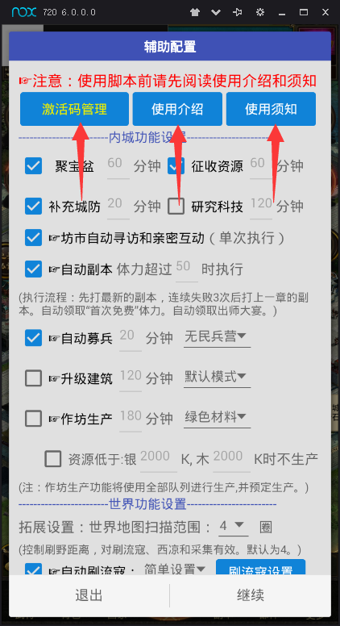
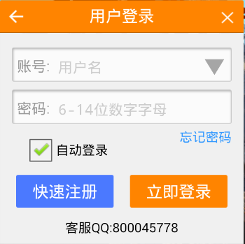
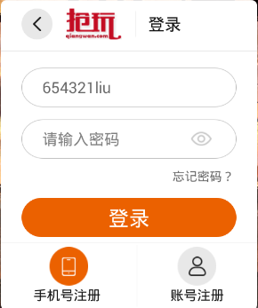
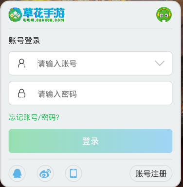
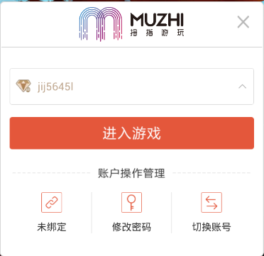
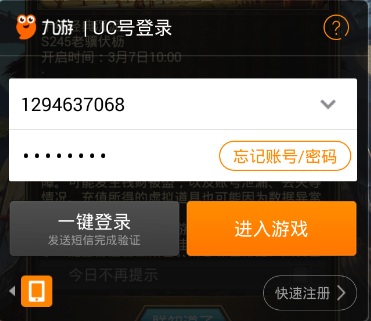

# 目录
### [一、前提](#one)
### [二、辅助介绍](#two)
### [三、辅助安装](#three)
### [四、辅助使用](#four)
### [五、辅助配置介绍](#five)
### [六、常见问题](#six)

 
# 内容
### 一、前提
**使用辅助的前提条件：**
1. 你有安卓手机
	* 已经root
	* 分辨率为720x1280或1080x1920
	*（手机仍有可能不兼容，建议使用电脑）*
2. 你有电脑  
**满足1和2中任意一条就可以使用辅助**

 
### 二、辅助介绍
正统辅助是正统三国手游的一款自动挂机辅助。目前功能如下图：  

**适用对象：**
1. 安卓玩家
2. 与安卓数据互通的苹果玩家。（数据互通：苹果版游戏账号可以在安卓版上登录）

 
### 三、辅助安装  
*手机安装辅助和安装其他app相同。手机很可能不兼容，推荐使用电脑。*  

**电脑安装辅助步骤**
1. 下载安装安卓模拟器（推荐使用夜神模拟器和mumu模拟器）  
	[夜神模拟器](http://www.yeshen.com)：可多开，只能Windows系统使用。  
	[mumu模拟器](http://mumu.163.com)：不能多开，Windows和Mac OS系统都可以使用。  
2. 设置模拟器分辨率（以夜神为例，mumu同理）
	自定义分辨为宽：720，高：1280，DPI：320。  
	  
	  
	设置完后重启模拟器。  
	（模拟器性能设置根据自己情况自行设置，性能设置越高越流畅）
3. 下载安装游戏和辅助  
	* 下载自己玩的平台的游戏安装包到电脑上，然后安装到模拟器上。  
	     
	[各个平台游戏下载地址](https://github.com/liuyong0/liuyong0.github.io/blob/master/%E5%90%84%E4%B8%AA%E5%B9%B3%E5%8F%B0%E6%B8%B8%E6%88%8F%E4%B8%8B%E8%BD%BD%E5%9C%B0%E5%9D%80.md)  
	[如何知道自己是哪个游戏平台？](#five)  
	
	* 下载辅助安装到模拟器上。  
	[辅助下载](https://github.com/liuyong0/liuyong0.github.io/raw/master/%E6%AD%A3%E7%BB%9F%E8%BE%85%E5%8A%A9V1.80.apk)  
	安装好后是这样的：  
	  
	

	
 
### 四、辅助使用
1. 打开辅助，点击“允许”给予root权限
	 
2. 点击播放，调出控制条  
	  
	控制条按钮功能介绍：  
	   
	
3. 按模拟器home键返回桌面，打开并登录游戏，调到游戏内城界面点击控制条”播放“辅助。  

4. 同意使用协议，输入激活码（激活码找群主购买）  
	  
	激活成功以后会显示**辅助配置**界面。第一次使用建议依次查看以下三个界面。
	

	
 
### 五、辅助配置介绍
	**辅助功能：**辅助配置界面功能分为内城功能、世界功能和其他功能。内城功能为内城建筑对应的操作；世界功能主要为刷怪、采集和收图纸；其他功能包括自动登录、监控攻击和名将加忠。  
	**辅助执行过程：**辅助执行原理为根据设置的循环时间，每隔一段时间循环执行该项功能。
	下面以内城功能为例，介绍辅助使用：  
	  
	框1：功能开关，不勾选则不执行该功能。
	框2：功能名称，所有黑色的都为功能名称。
	框3：循环时间，设置该功能多长时间执行一次。设置“xx分钟”的都为循环时间。

 
### 六、常见问题
1. 如何知道自己是哪个游戏平台？  
	判断游戏为哪个平台主要看游戏登录界面或者平台悬浮图标。  
	平台|图标
	:-:|:-:
	官方版(萝卜版)| 
	九玩版|  
	抢玩版|  
	草花版|  
	拇指版|  
	九游版|  
	小米版|  
	华为版|   
	
	

2. 辅助可以试用吗？
	不能。

3. 苹果玩家如何知道是否与安卓版数据互通？  
	苹果玩家先判断自己属于哪个平台，然后在模拟器里安装对应平台的安卓版，登录账号，看是否能看到自己的游戏角色。
	
